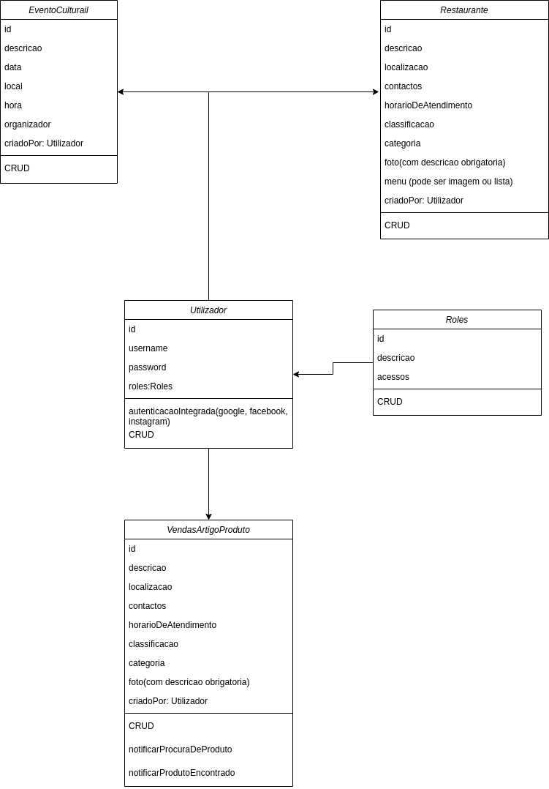

# Katlhula

## Introduction

This is a project that will be used to develop a a protoype for an application that aims to be used as a portal to
manage cultural events, search restaurants, expose products to sell and to give the users the oportunity to classify the
services offered in the application. In this project we will be testing a lot of sofltware development technologies with
proof of concepts in different branches, each of them to be created based on the test that we want to do.

 
Nota: Informações adicionadas na aplicação só podem ser alteradas pelos seus criadores (por enquanto, enquanto não é
adicionada a funcionalidade de se associar utilizadores).

## Initial requirements

- CRUD de eventos culturais:
    - Criar evento cultural;
    - _Consultar eventos culturais:_
        - Consultar um evento cultural específico por filtro (organizador, descrição, criador);
    - Consultar detalhes de evento cultural;
    - Actualizar informações de evento cultural;
    - _Remover evento cultural:_
        - Um evento removido fica no estado de inactivo;
        - Depois de estar no estado inactivo, pode-se remover ou reactivar um evento e permitir actualizar as suas
          informações;
    - Um evento cultural pode ficar no estado de "por acontecer" se for para ser realizado numa data futura;
    - Um evento pode ficar no estado de "ja aconteceu" se a data de realização do mesmo ja tiver passado;

- CRUD de restaurantes (por categoria - gourmet, rodizio/churrasco, fast food...)
    - Consulta de menus e preços
    - Classificação de restaurantes (com secção de pontuação e comentários):
        - Restaurantes com pontuação máxima são colocados no topo da exposição;
    - Localização, contactos
    - Adição de fotos de pratos/bebidas favoritas com espaço para descrição

- Secção de CRUD (vendedores e) de venda de produtos e artigos:
    - Criar produto a vender;
        - _Consultar produtos e seus estados:_
            - Consultar um produto específico por filtro (categoria, descrição, criador);
        - Consultar detalhes de produtos;
        - Actualizar informações de produtos;
        - _Remover produto:_
            - Um produto removido fica no estado de inactivo;
            - Depois de estar no estado inactivo, pode-se remover ou reactivar um produto e permitir actualizar as suas
              informações;
        - Um produto pode ficar no estado de "disponível" se não tiver sido vendido;
        - Um produto pode ficar no estado de "vendido" se já tiver sido vendido e essa alteração pode ser feita pelo
          comprador se este tiver o código do produto que deverá ser fornecido obrigatoriamente pelo vendedor como
          alguma forma de garantia;
    - Deve ser possível efectuar a procura de artigos com notificação a vendedores e notificação de disponibilidade de artigos
      procurados

## Katlhula class diagram

